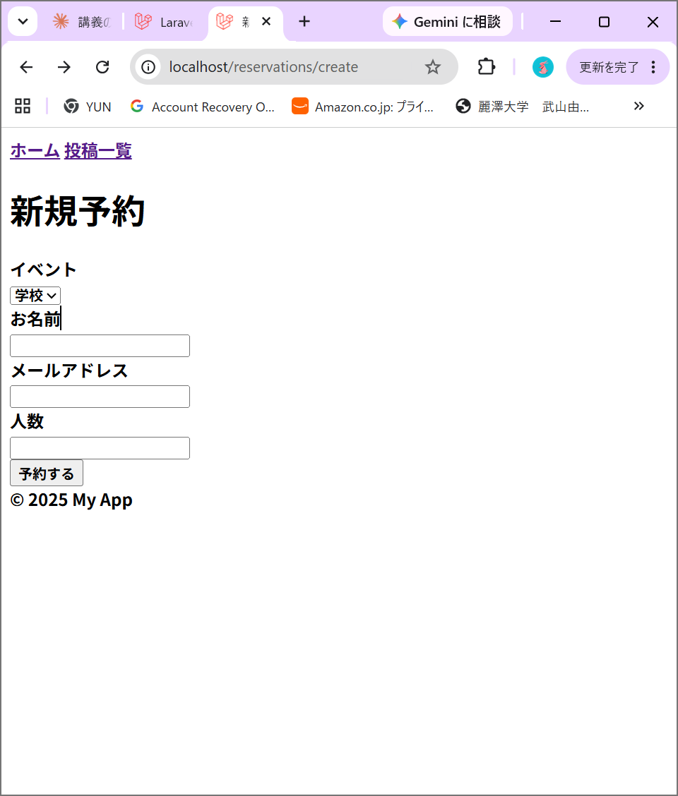
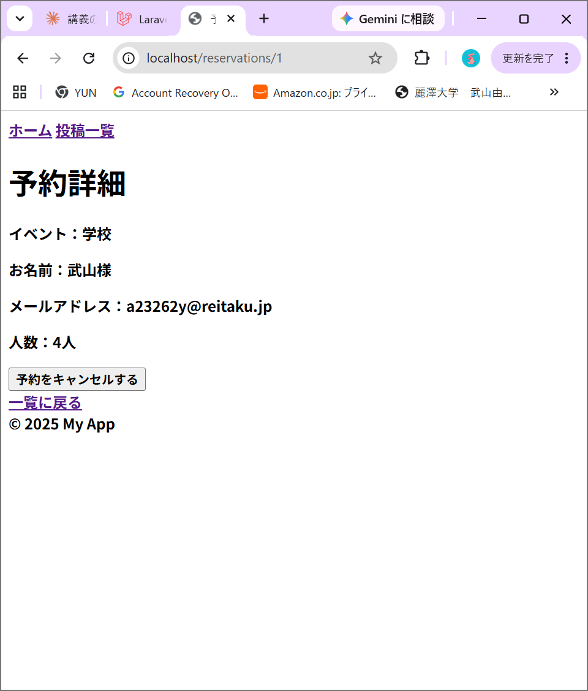
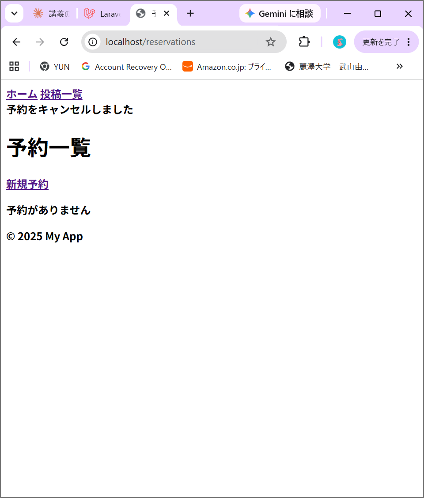
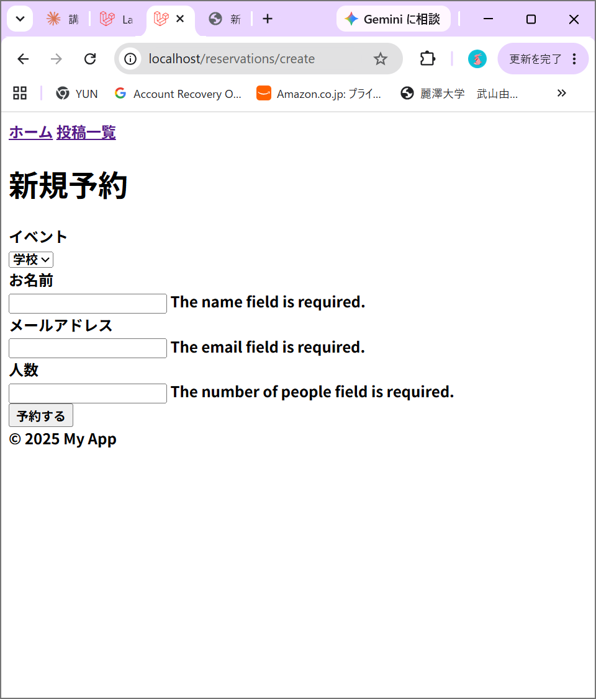

# Week9: 設計・責務分離 + DB設計の深化

## 概要
Repository/Serviceパターンを用いて、既存のブログアプリをリファクタリングし、
新たにタスク管理アプリをRepository/Serviceパターンで新規構築した。

## Before / After（ブログアプリ: PostController）

### Before
- バリデーション・DB操作（検索・作成・更新・削除）が、すべて1つのControllerに直接書かれていた
- 認可チェック（自分の投稿かどうか）が実装されておらず、誰でも他人の投稿を編集・削除できる状態だった

### After
- **PostRepository**: DB操作（全件取得・1件取得・作成・更新・削除）のみを担当
- **PostService**: ビジネスロジック（投稿の作成・更新・削除の一連の流れ）を担当
- **PostController**: リクエストを受け取り、バリデーションを行い、Service/Repositoryに処理を橋渡しするだけの薄い層になった
- **PostPolicy**: 「自分の投稿のみ編集・削除できる」という認可ルールを1箇所に集約

### リファクタリングの所感
リファクタリング後のコードは、Before と比べて行数自体は増えた。
しかし、各メソッドが「Repositoryを呼ぶ」「Serviceを呼ぶ」という
同じパターンの繰り返しになったことで、コード全体としては見やすくなった。
今後、機能追加や仕様変更が発生した際も、影響範囲が
Repository・Service・Policyのどこか1箇所のクラスに閉じるため、
修正がしやすくなると感じた。→責任分離の考え方

### 今後の学習ポイント
- 現時点では、「どのクラスに何を書くべきか」という判断基準は、
Repository（DB操作）・Service（業務ロジック）・Policy（認可ルール）・
Controller（リクエストの橋渡し）という大枠は理解できたが、
実際の変更要望に対して「どの層を直すべきか」を素早く判断できる
感覚は十分に身についておらず、まだ実践を重ねる必要がある。
- 同じ型を使うことで変更修正がしやすいのはわかったが、具体的に変更したい箇所に対してどの部分を変更するかといった判断は練習が櫃うようである。

## 練習課題1: タスク管理アプリ

### 概要
最初からRepository/Serviceパターンでタスク管理アプリを構築した。

### テーブル定義（tasks）
| カラム名 | 型 | 説明 |
|---|---|---|
| id | bigint | 主キー（自動採番） |
| title | string | タイトル |
| description | text | 詳細 |
| due_date | date | 期限 |
| priority | string | 優先度（高・中・低） |
| is_completed | boolean | 完了したかどうか（デフォルトfalse） |
| user_id | bigint | どのユーザーのタスクか（外部キー） |
| created_at | timestamp | 作成日時 |
| updated_at | timestamp | 更新日時 |

### 実装したクラス
- TaskRepository / TaskService / TaskController / TaskPolicy
- 「完了にする」専用メソッド（markAsCompleted）をServiceに用意し、
  単一責任の原則を意識した設計にした

## 既知の問題（解決済み）
作業中、Laravel Breeze（認証機能）がmasterブランチに正しく反映されて
いない問題が発覚したため、Breezeの再インストールを行い復旧した。

---# Laravel Docker 開発環境

## 必要なもの
- Docker Desktop

## セットアップ手順

1. リポジトリをクローン
2. コンテナを起動
docker compose up -d
3. Laravelをインストール
docker compose exec app bash
composer install
exit
4. .envを設定（DB_HOSTをdbに変更）
5. マイグレーション実行
docker compose exec app php artisan migrate
6. ブラウザで確認
http://localhost

## 使用サービス
- Laravel: http://localhost
- phpMyAdmin: http://localhost:8080
- MySQL: localhost:3306

---

# Week7: ブログシステム

## 概要
LaravelのMVCパターンを使った、投稿のCRUD機能を持つブログシステムです。

## 機能一覧
- 投稿一覧表示（ページネーション付き）
- 投稿詳細表示
- 投稿作成（タイトル、内容、カテゴリー）
- 投稿編集
- 投稿削除
- バリデーション実装
- Bladeレイアウト継承

## テーブル定義（posts）
| カラム名 | 型 | 説明 |
|---|---|---|
| id | bigint | 主キー（自動採番） |
| title | string(200) | タイトル |
| content | text | 内容 |
| category | string | カテゴリー |
| created_at | timestamp | 作成日時 |
| updated_at | timestamp | 更新日時 |

## スクリーンショット
（ここに画像を貼ります）

---

# Week7練習1: 商品管理システム

## 概要
商品のCRUD機能を持つ、商品管理システムです。

## 機能一覧
- 商品一覧表示
- 商品詳細表示
- 商品作成（商品名、価格、説明、在庫数、カテゴリー）
- 商品編集
- 商品削除
- バリデーション実装

## テーブル定義（products）
| カラム名 | 型 | 説明 |
|---|---|---|
| id | bigint | 主キー（自動採番） |
| name | string | 商品名 |
| price | integer | 価格 |
| description | text | 説明 |
| stock | integer | 在庫数 |
| category | string | カテゴリー |
| created_at | timestamp | 作成日時 |
| updated_at | timestamp | 更新日時 |

## スクリーンショット

---

# Week7練習2: 予約システム

## 概要
イベント予約システムです。1つのイベントに対して、複数の予約が紐づく構成になっています。

## 機能一覧
- イベント一覧
- イベント詳細
- 予約作成（名前、メール、人数、日時）
- 予約一覧
- 予約のキャンセル

## テーブル定義（events）
| カラム名 | 型 | 説明 |
|---|---|---|
| id | bigint | 主キー（自動採番） |
| name | string | イベント名 |
| description | text | 説明 |
| date | dateTime | 開催日時 |
| created_at | timestamp | 作成日時 |
| updated_at | timestamp | 更新日時 |

## テーブル定義（reservations）
| カラム名 | 型 | 説明 |
|---|---|---|
| id | bigint | 主キー（自動採番） |
| event_id | bigint | どのイベントへの予約か（外部キー） |
| name | string | 予約者名 |
| email | string | メールアドレス |
| number_of_people | integer | 人数 |
| created_at | timestamp | 作成日時 |
| updated_at | timestamp | 更新日時 |

## スクリーンショット

