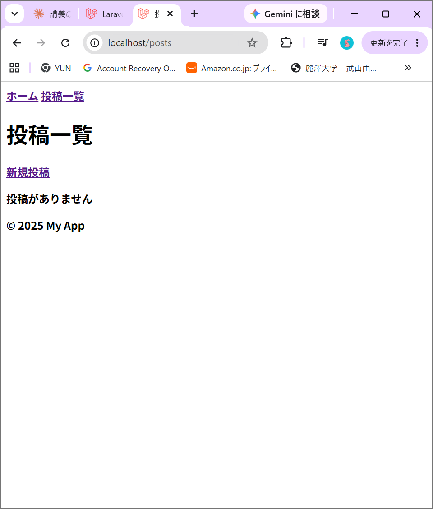
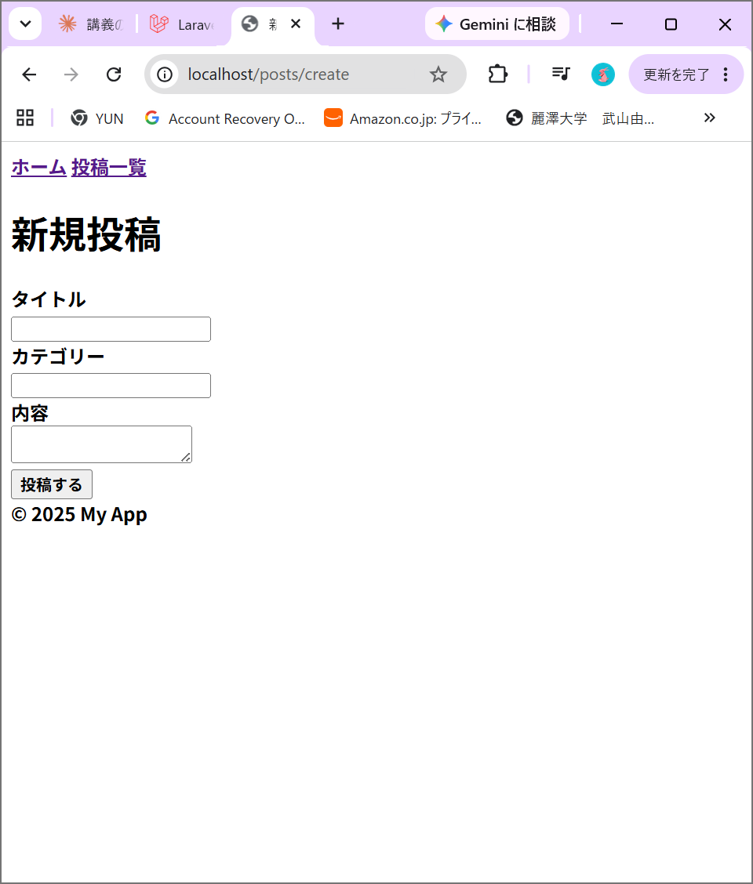
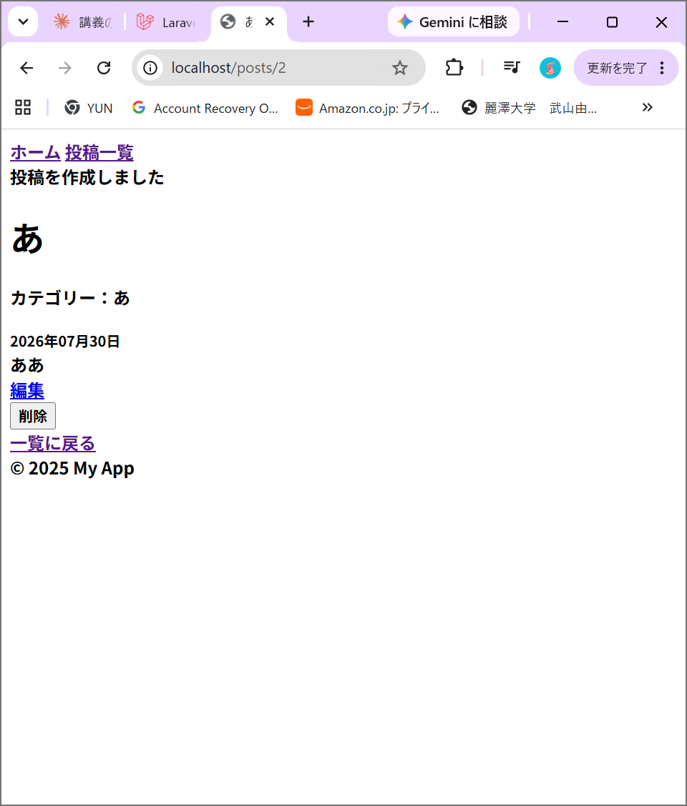
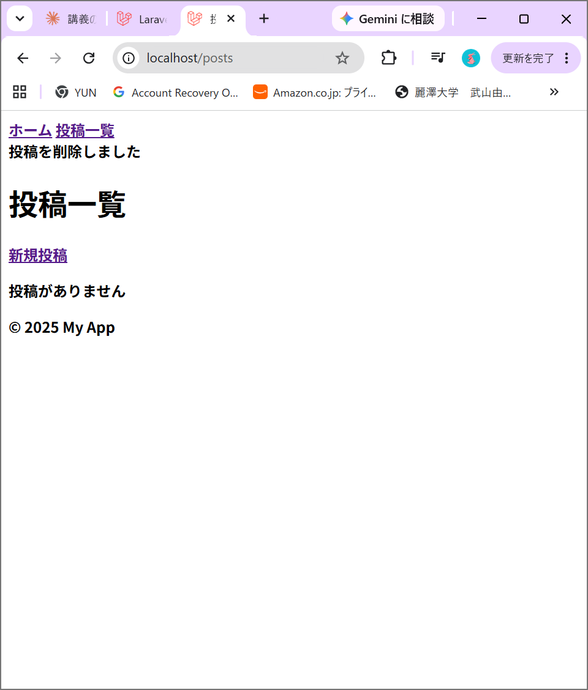

# Laravel Docker 開発環境

## 必要なもの
- Docker Desktop

## セットアップ手順

1. リポジトリをクローン
2. コンテナを起動
docker compose up -d
3. Laravelをインストール
docker compose exec app bash
composer install
exit
4. .envを設定（DB_HOSTをdbに変更）
5. マイグレーション実行
docker compose exec app php artisan migrate
6. ブラウザで確認
http://localhost

## 使用サービス
- Laravel: http://localhost
- phpMyAdmin: http://localhost:8080
- MySQL: localhost:3306

---

# Week7: ブログシステム

## 概要
LaravelのMVCパターンを使った、投稿のCRUD機能を持つブログシステムです。

## 機能一覧
- 投稿一覧表示（ページネーション付き）
- 投稿詳細表示
- 投稿作成（タイトル、内容、カテゴリー）
- 投稿編集
- 投稿削除
- バリデーション実装
- Bladeレイアウト継承

## テーブル定義（posts）
| カラム名 | 型 | 説明 |
|---|---|---|
| id | bigint | 主キー（自動採番） |
| title | string(200) | タイトル |
| content | text | 内容 |
| category | string | カテゴリー |
| created_at | timestamp | 作成日時 |
| updated_at | timestamp | 更新日時 |

## スクリーンショット
（ここに画像を貼ります）

