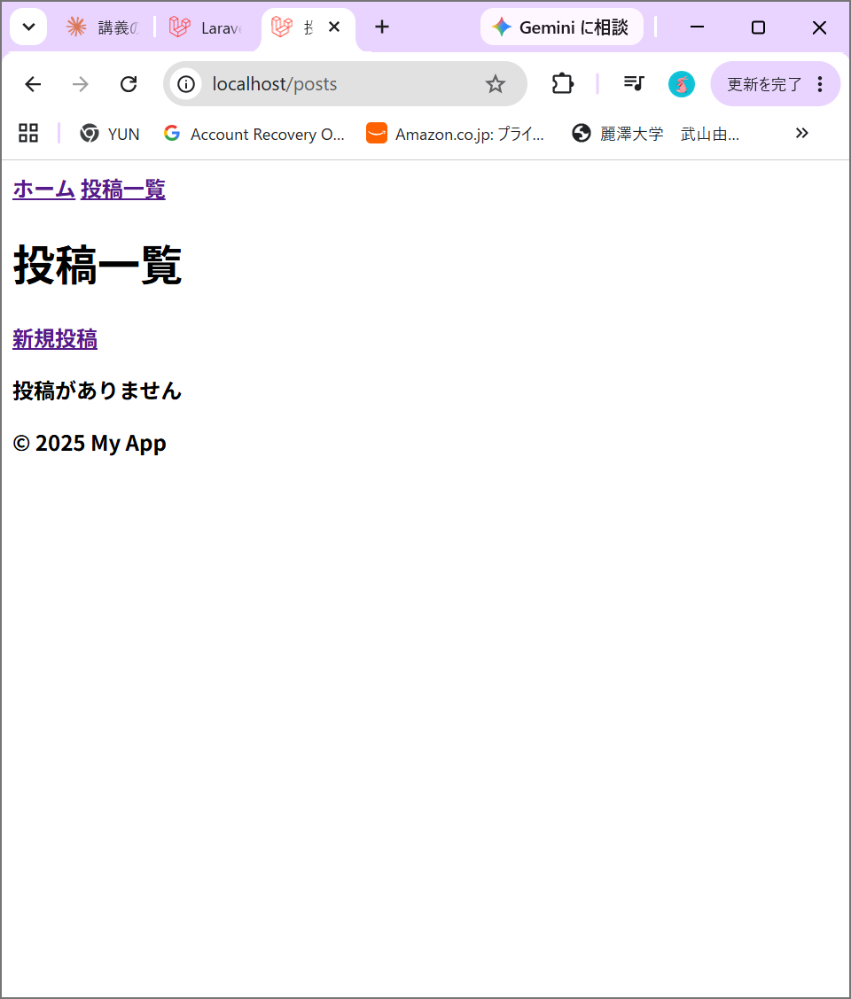
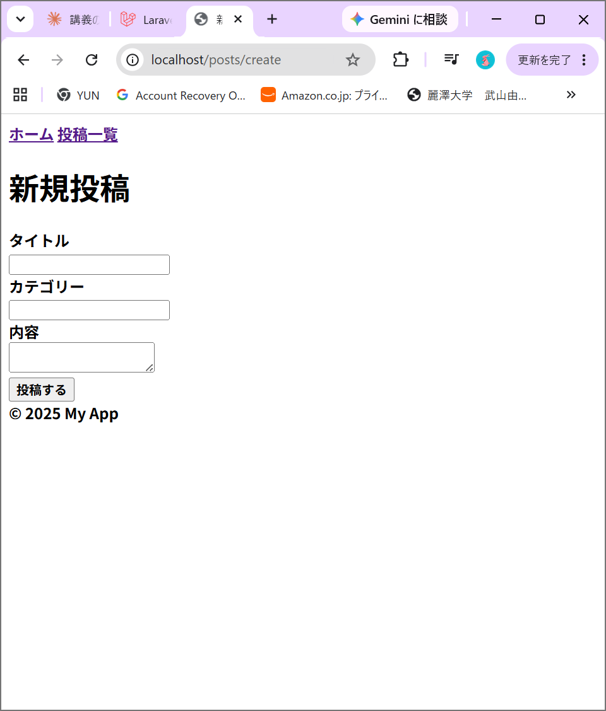
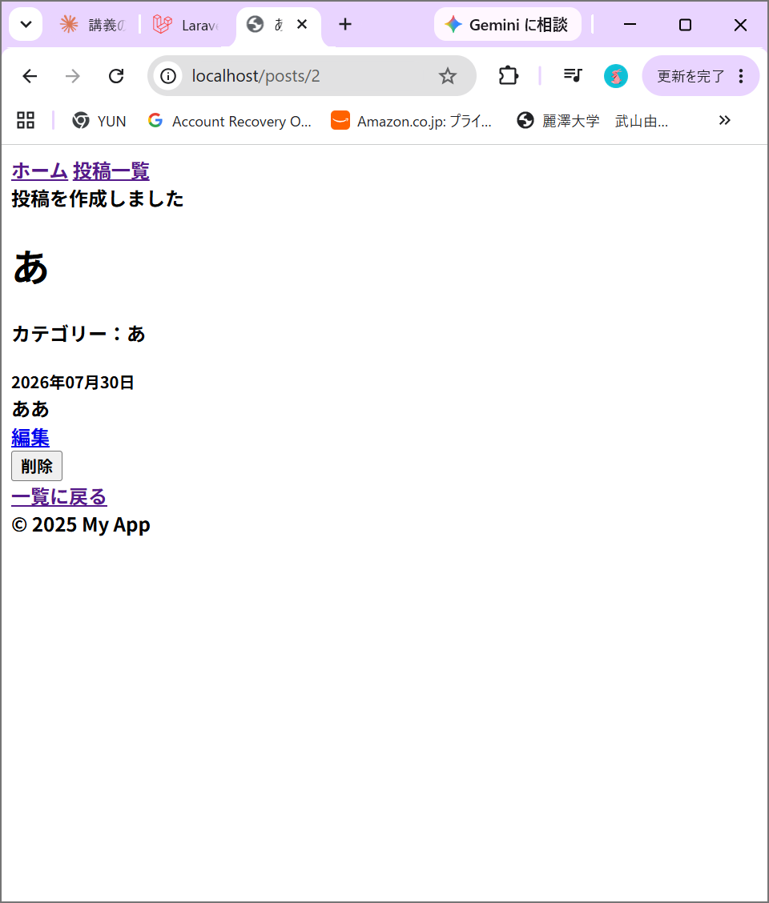
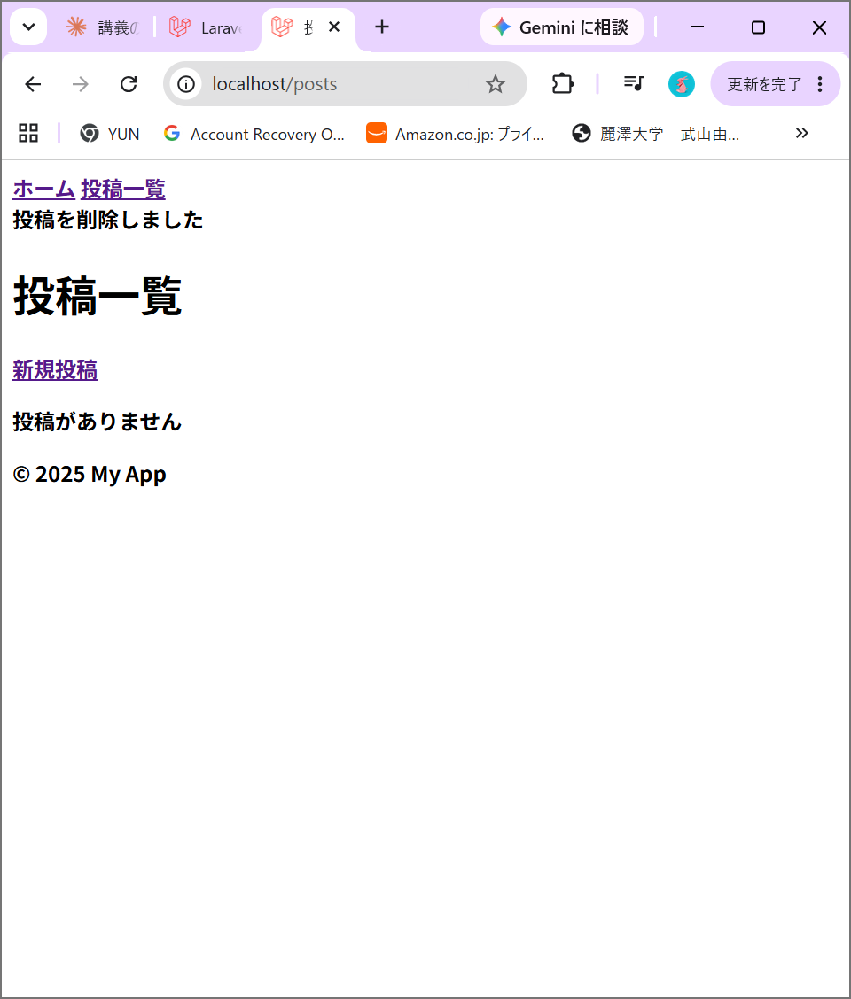

# Week9: 設計・責務分離 + DB設計の深化

## 概要
Repository/Serviceパターンを用いて、既存のブログアプリをリファクタリングし、
新たにタスク管理アプリをRepository/Serviceパターンで新規構築した。

## Before / After（ブログアプリ: PostController）

### Before
- バリデーション・DB操作（検索・作成・更新・削除）が、すべて1つのControllerに直接書かれていた
- 認可チェック（自分の投稿かどうか）が実装されておらず、誰でも他人の投稿を編集・削除できる状態だった

### After
- **PostRepository**: DB操作（全件取得・1件取得・作成・更新・削除）のみを担当
- **PostService**: ビジネスロジック（投稿の作成・更新・削除の一連の流れ）を担当
- **PostController**: リクエストを受け取り、バリデーションを行い、Service/Repositoryに処理を橋渡しするだけの薄い層になった
- **PostPolicy**: 「自分の投稿のみ編集・削除できる」という認可ルールを1箇所に集約

### リファクタリングの所感
リファクタリング後のコードは、Before と比べて行数自体は増えた。
しかし、各メソッドが「Repositoryを呼ぶ」「Serviceを呼ぶ」という
同じパターンの繰り返しになったことで、コード全体としては見やすくなった。
今後、機能追加や仕様変更が発生した際も、影響範囲が
Repository・Service・Policyのどこか1箇所のクラスに閉じるため、
修正がしやすくなると感じた。→責任分離の考え方

### 今後の学習ポイント
- 現時点では、「どのクラスに何を書くべきか」という判断基準は、
Repository（DB操作）・Service（業務ロジック）・Policy（認可ルール）・
Controller（リクエストの橋渡し）という大枠は理解できたが、
実際の変更要望に対して「どの層を直すべきか」を素早く判断できる
感覚は十分に身についておらず、まだ実践を重ねる必要がある。
- 同じ型を使うことで変更修正がしやすいのはわかったが、具体的に変更したい箇所に対してどの部分を変更するかといった判断は練習が櫃うようである。

## 練習課題1: タスク管理アプリ

### 概要
最初からRepository/Serviceパターンでタスク管理アプリを構築した。

### テーブル定義（tasks）
| カラム名 | 型 | 説明 |
|---|---|---|
| id | bigint | 主キー（自動採番） |
| title | string | タイトル |
| description | text | 詳細 |
| due_date | date | 期限 |
| priority | string | 優先度（高・中・低） |
| is_completed | boolean | 完了したかどうか（デフォルトfalse） |
| user_id | bigint | どのユーザーのタスクか（外部キー） |
| created_at | timestamp | 作成日時 |
| updated_at | timestamp | 更新日時 |

### 実装したクラス
- TaskRepository / TaskService / TaskController / TaskPolicy
- 「完了にする」専用メソッド（markAsCompleted）をServiceに用意し、
  単一責任の原則を意識した設計にした

## 既知の問題（解決済み）
作業中、Laravel Breeze（認証機能）がmasterブランチに正しく反映されて
いない問題が発覚したため、Breezeの再インストールを行い復旧した。

---# Laravel Docker 開発環境

## 必要なもの
- Docker Desktop

## セットアップ手順

1. リポジトリをクローン
2. コンテナを起動
docker compose up -d
3. Laravelをインストール
docker compose exec app bash
composer install
exit
4. .envを設定（DB_HOSTをdbに変更）
5. マイグレーション実行
docker compose exec app php artisan migrate
6. ブラウザで確認
http://localhost

## 使用サービス
- Laravel: http://localhost
- phpMyAdmin: http://localhost:8080
- MySQL: localhost:3306

---

# Week7: ブログシステム

## 概要
LaravelのMVCパターンを使った、投稿のCRUD機能を持つブログシステムです。

## 機能一覧
- 投稿一覧表示（ページネーション付き）
- 投稿詳細表示
- 投稿作成（タイトル、内容、カテゴリー）
- 投稿編集
- 投稿削除
- バリデーション実装
- Bladeレイアウト継承

## テーブル定義（posts）
| カラム名 | 型 | 説明 |
|---|---|---|
| id | bigint | 主キー（自動採番） |
| title | string(200) | タイトル |
| content | text | 内容 |
| category | string | カテゴリー |
| created_at | timestamp | 作成日時 |
| updated_at | timestamp | 更新日時 |

## スクリーンショット
（ここに画像を貼ります）

---

# Week11: AWS基礎・本番環境デプロイ

## 概要
Week6で構築したDocker環境を、AWS(EC2・RDS)上にデプロイし、インターネットからアクセスできる本番環境を構築した。

## デプロイ構成
- **EC2**: Ubuntu Server 26.04 LTS, t3.micro(無料利用枠)
- **RDS**: MySQL 8.0, db.t4g.micro(無料利用枠)
- **Webサーバー**: Nginx + PHP-FPM(Docker)

## デプロイ手順
1. EC2インスタンスを作成し、SSHで接続
2. RDSインスタンスを作成し、Laravelの`.env`にDB接続情報を設定
3. EC2にDocker・Docker Composeをインストール
4. GitHubからリポジトリをclone
5. `docker compose up -d`でコンテナを起動
6. `composer install`・`php artisan key:generate`・`php artisan migrate`を実行
7. ブラウザから動作確認

## セキュリティグループの設計

| タイプ | ポート | 送信元(ソース) | 理由 |
|---|---|---|---|
| SSH | 22 | 自分のIPのみ(`/32`) |SSHは管理者がサーバーの中身を設定するための入り口のような場所で、ポート範囲を全世界のままにすると、ブルーフォース攻撃という総当たりのパスワード攻撃に遭ったり、EC2からのアクセスを通じてネット上からDBに不正アクセスされ乗っ取られるなどの危険があるため。
| HTTP | 80 | 全世界(`0.0.0.0/0`) | 一般人がブラウザでウェブサイトにアクセスするためのものなのでこれは逆に全世界でないと自分以外の人がサイトを見ることができずに意味がないから|
| HTTPS | 443 | 全世界(`0.0.0.0/0`) | こちらもHTTPと同じように誰でもウェブサイトを閲覧できるように全世界へ公開になっている。現在はweek13で実施予定のHTTPS化に備えて開放してる状態になっている。 |
| MySQL(RDS) | 3306 | EC2のセキュリティグループのみ | 自分自身ではなくサーバーのEC2がアクセスするためEC2ノセキュリティグループのみができる状態になっていればいいから送信元を限定することで、ネット上全体からの直接アクセスを防ぐ。またRDS自体のパブリックアクセスも無効なので二重で保護している。|

## 練習課題1: S3への画像アップロード機能

### 概要
Laravel Storageファサードを使い、アップロードされた画像をEC2のディスクではなく、Amazon S3に直接保存する機能を実装した。

### 実装内容
- S3バケットを作成(`yuna-laravel-uploads-2026`、東京リージョン)
- IAMユーザーを作成し、`AmazonS3FullAccess`ポリシーをアタッチしてアクセスキーを発行
- `league/flysystem-aws-s3-v3`パッケージをインストール
- `.env`にAWSの接続情報(アクセスキー、リージョン、バケット名)を設定
- `S3UploadController`を作成し、画像を受け取ってS3に保存、URLを返す処理を実装
- アップロード用フォーム画面(`s3-upload.blade.php`)を作成

### つまずいた点と解決策
- Nginxのデフォルト設定では、アップロードできるファイルサイズに上限があり、`413 Request Entity Too Large`エラーが発生した。`docker/nginx/default.conf`に`client_max_body_size 10M;`を追加して解決した。
- Laravel側のバリデーション(`max:2048`)により、2MBを超える画像はアップロードできない仕様になっている。

### 動作確認
`http://EC2のIPアドレス/s3-upload` にアクセスし、画像をアップロードして、S3上のURLが発行され、画像が正しく表示されることを確認した。

---

# Week12: 外部API連携（Stripe決済・SendGridメール・Webhook）

## 概要
Stripe・SendGridという2つの外部APIサービスと連携し、決済機能とメール送信機能を実装した。また、Stripeからの非同期通知（Webhook）を受信し、署名検証を行った上で処理する仕組みを構築した。

## 実装内容

### 基本課題: Stripeテスト決済機能
- Stripe Checkout Sessionを使った決済フロー（商品ページ→決済→完了ページ）を実装
- テストカード（4242 4242 4242 4242）で決済が通ることを確認
- 決済完了後、購入履歴をDB（purchasesテーブル）に保存する処理を実装

### テーブル定義（purchases）
| カラム名 | 型 | 説明 |
|---|---|---|
| id | bigint | 主キー（自動採番） |
| stripe_session_id | string | StripeのCheckout SessionID |
| product_name | string | 商品名 |
| amount | integer | 決済金額（円） |
| email | string | 購入者のメールアドレス（nullable） |
| created_at | timestamp | 作成日時 |
| updated_at | timestamp | 更新日時 |

### 練習課題1: SendGridによるウェルカムメール送信
- 会員登録完了時に、SendGrid経由でウェルカムメールを自動送信する機能を実装
- SendGridのSingle Sender Verificationで送信元メールアドレスを認証
- SendGridのActivity Feedで、メールが正常に配達されたことを確認済み

### 練習課題2: Stripe Webhookによる決済完了処理
- Stripe CLIを使ってローカル環境にWebhookをフォワードし、動作確認
- 署名検証（Webhook::constructEvent()）を実装し、不正なリクエストを拒否する仕組みを構築
- 決済完了イベント（payment_intent.succeeded）を受信した際、決済IDをログに記録する処理を実装

## つまずいた点と解決策
- `.env`にAPIキーを設定しても、`config/services.php`側に橋渡しの設定（`env('STRIPE_SECRET')`など）を追記し忘れており、決済処理がタイムアウトする問題が発生した。`config:clear`でキャッシュをクリアし、設定を追記することで解決した。
- SendGridでのメール送信時、送信元アドレス（MAIL_FROM_ADDRESS）がSendGrid側で未認証だったため「550 The from address does not match a verified Sender Identity」というエラーが発生した。Single Sender Verificationで実際に受信できるメールアドレスを認証することで解決した。
- Docker環境のポート番号が、Docker用の`.env`に`APP_PORT`を設定していなかったため、コンテナ再起動のたびにランダムに変わる問題があった。

## 改善対応
提出後のレビューで以下についての指摘を頂いた。（3点）※現在は修正済み

1. **例外処理の追加**: `Session::create()`・`Session::retrieve()`をtry/catchで囲み、`ApiErrorException`を捕捉してログに記録した上で、ユーザーには分かりやすいエラーメッセージを表示するよう修正した。
2. **決済成功ページの重複保存防止**: `success`メソッドで`payment_status === 'paid'`をチェックし、`firstOrCreate`を使うことで、同一の`session_id`による重複保存・不正なアクセスでの保存を防止した。
3. **`.env.example`の追記**: `STRIPE_WEBHOOK_SECRET`とSendGrid用の`MAIL_`設定項目を追記し、環境構築時に必要な項目が一目で分かるようにした。

## 動作確認
- `http://localhost:PORT/checkout`からテストカードで決済を実施し、DBへの保存・Stripeダッシュボードでの取引記録を確認。
- 会員登録後、SendGridのActivity Feedで「Delivered」ステータスと開封（Opens）を確認した。
- `stripe trigger payment_intent.succeeded`を実行し、Laravelのログに決済IDが正しく記録されることを確認した。

---